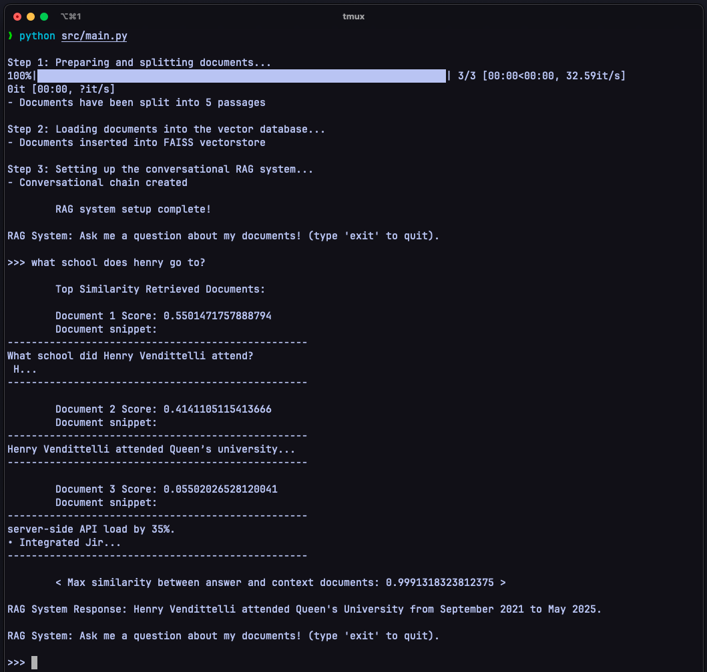

# Local RAG System

A local implementation of a Retrieval-Augmented Generation (RAG) pipeline using a local Llama 3.2 via Ollama. This project allows document-based question answering by integrating document loading, vector database storage, and a conversational retrieval system.


## **Setup Instructions**

### 1. Clone the Repository

To get started, clone this repository with:

```bash
git clone git@github.com:hvenry/Local-RAG-System.git
```

Now, navigate into the cloned repo:

```bash
cd Local-RAG-System
```

### 2. Create Environment

In order to use this local RAG system, you will first need to create a `conda` environment with the requirements. This can be done using the `environment.yml` file:

```bash
conda env create -f environment.yml
```

After the environment has successfully been created, activate it with:

```bash
conda activate local_rag_system_env
```

### 3. Setup Local LLM

This project is built natively for using OLlama, but you are welcome to use any model or API keys instead of the default assumption you are using `Llama 3.2` via Ollama.

In order to setup using Ollama, first download [here](https://ollama.com/) and then run in your CLI:

```bash
ollama run llama3.2
```

Now you should have a local instance of `llama3.2` running on `http://localhost:11434` by default. You can confirm this by using curl, or just go check your browser, you should see:

```
Ollama is running
```

### 4. Start the RAG system! 

To start the system run:

```bash
python src/main.py
```

Notice now, a `/vectorstore` folder is created to store embeddings for documents under `/data`. Feel free to delete existing ones and try out any `PDF`, `docx`, or `csv` files of your own!

Now you should be greeted with a prompt to ask questions. (Try asking what school Henry went to).

## How it works

### 1. Prepare and Split Documents

The script will load documents from the `data` directory and split them into smaller chunks for processing. This is done using the `DirectoryLoader` from `langchain_community.document_loaders` and `RecursiveCharacterTextSplitter` from `langchain.text_splitter`.

### 2. Load Documents into Vector Database

The split documents are converted into vector representations using the `HuggingFaceEmbeddings` model from `langchain_huggingface`. These embeddings are then stored in a FAISS (Facebook AI Similarity Search) vector database for efficient similarity search. The `normalize` function from `sklearn.preprocessing` is used to normalize the embeddings.

### 3. Set Up Conversational RAG System

A conversational retrieval-augmented generation (RAG) system is set up using the vector database and a local instance of the Llama model. This involves creating a retriever from the vector database and setting up a conversational chain using `langchain` components such as `ChatPromptTemplate`, `create_retrieval_chain`, and `create_stuff_documents_chain`.

### 4. Ask Questions

You can now interact with the system by asking questions. The system will retrieve relevant documents and generate answers based on the context. The similarity between the generated answer and the context documents is calculated using cosine similarity from `sklearn.metrics.pairwise`.


## Python Libraries Used

- **langchain**: A library for building language model applications.
- **langchain_community**: Community-contributed extensions for `langchain`.
- **langchain_huggingface**: Integration with Hugging Face models.
- **langchain_ollama**: Integration with Ollama models.
- **faiss**: A library for efficient similarity search and clustering of dense vectors.
- **scikit-learn**: A machine learning library for Python, used here for normalization and similarity calculations.
- **sentence-transformers**: A library for sentence embeddings using transformers.
- **torch**: A deep learning library used by some embedding models.
- **PyPDF2**: A library for reading PDF files.
- **python-docx**: A library for reading DOCX files.
- **pandas**: A data manipulation library, used here for reading CSV files.

## Specific Components

### Encoders

The `HuggingFaceEmbeddings` model from `langchain_huggingface` is used to convert text into vector embeddings. This model can be replaced with any other embedding model as needed.

### Vector Stores

FAISS (Facebook AI Similarity Search) is used as the vector store for efficient similarity search. The embeddings are stored in a FAISS index, which allows for fast retrieval of similar documents.

### Similarity Measurements

Cosine similarity is used to measure the similarity between the generated answer and the context documents. This is done using the `cosine_similarity` function from `sklearn.metrics.pairwise`.

### Chaining

The conversational RAG system is set up using `langchain` components. The `create_retrieval_chain` function is used to create a chain that retrieves relevant documents based on the user's query. The `create_stuff_documents_chain` function is used to create a chain that generates answers based on the retrieved documents.

## Project Structure

```
root/
│
├── data/                           # folder documents can be inserted for RAG (PDF, docx, csv)
├── vectorstore/                    # local vectorstore (FAISS)
│   ├── db_faiss/
│   │   ├── index.faiss
│   │   ├── index.pkl
│
├── src/
│   ├── main.py                     # main driver
│   ├── utils.py                    # document similarity calculation code
│   ├── processing/
│   │   ├── data_processing.py      # document loaders and chunkers
│   │   ├── vectorstore.py          # embed and store documents to vector db
│   ├── conversation/
│   │   ├── conversation_chain.py   # conversation memory
│
├── .gitignore
├── environment.yml                 # conda env details
├── readme.md
└── requirements.txt
```

This structure organizes the code into different folders based on functionality, making it easier to manage and maintain.

## Conclusion

This project demonstrates how to build a local Retrieval-Augmented Generation (RAG) system using Python and various libraries. By following the setup instructions and understanding the components involved, you can extend and customize this system for your own use cases.

## Screenshots

### Testing the RAG system with my resume and some other documents:

Testing this local rag with three documents, 1 being my resume (ranked 3), second being information on my education (ranked 2), third answering a question about my education (ranked 1).



### GPU consumption :O (use Llama 3.2 with caution!)

